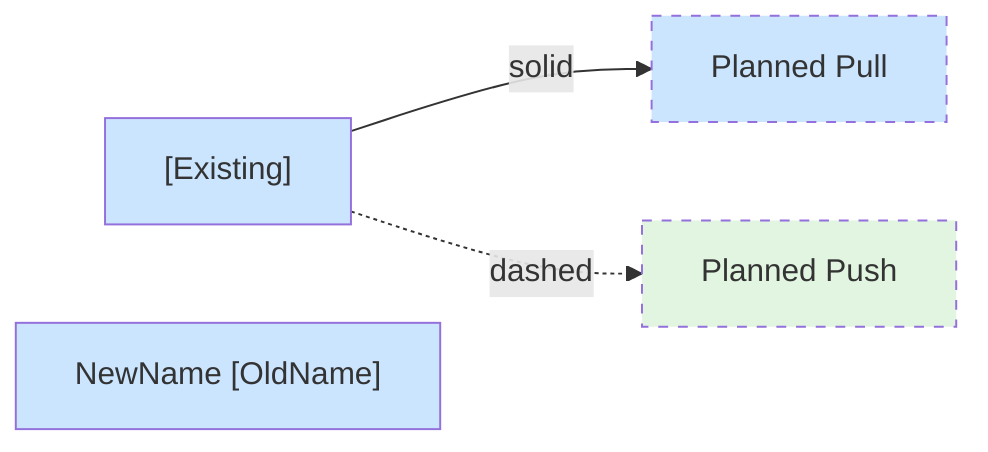
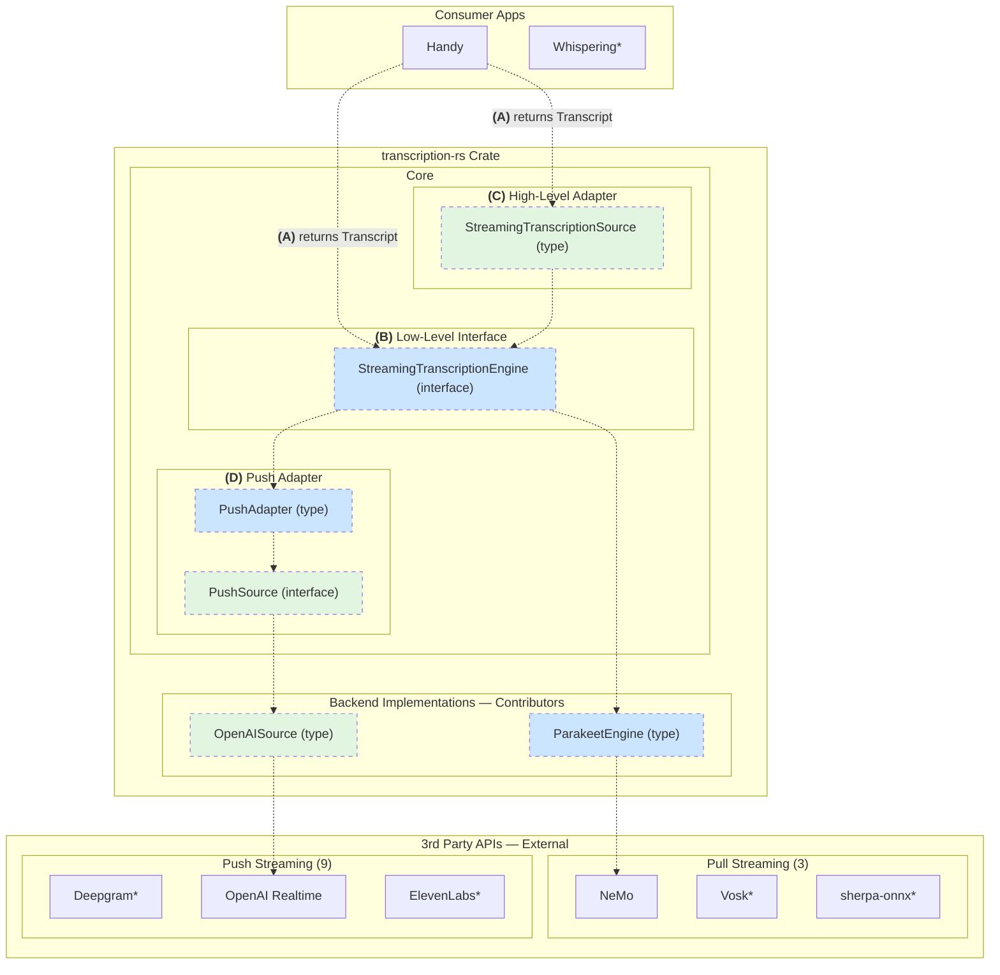
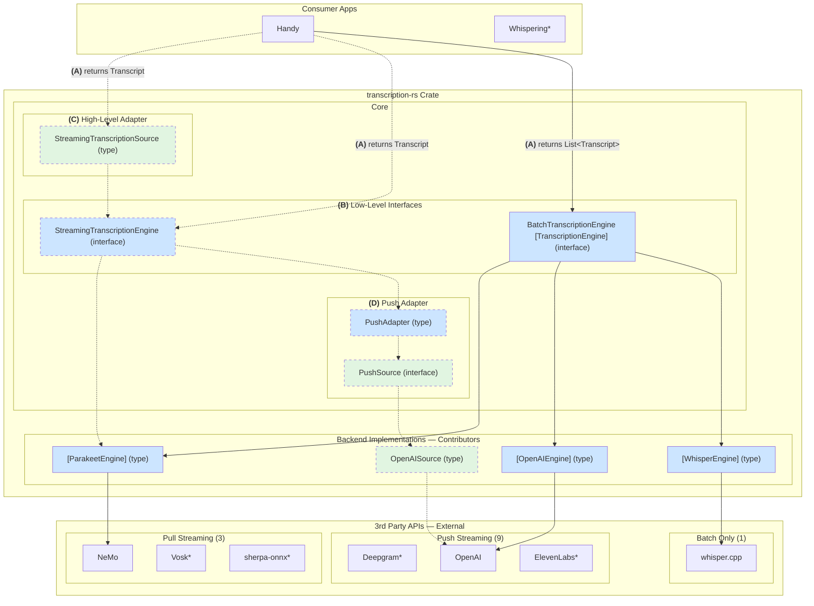

# transcription-rs API Design

## Overview

**transcription-rs** unifies transcription APIs behind a common interface.

**Why:** transcribe-rs handles batch transcription well, but:
- No streaming support (partial results as you speak)
- Streaming is more complex than batch — async operations, interim results that get revised, endpoint detection
- Current `TranscriptionResult` type has gaps
- Streaming APIs vary widely: some push results via callbacks, others require polling; fields and semantics differ

**What's new:**
- Streaming transcription support via `StreamingTranscriptionEngine`
- One `Transcript` type for all results (batch, streaming partial, streaming final)
- Swappable backends — switch providers without changing app code

**Optional adapters** handle the push/pull impedance mismatch: most cloud APIs are push-based (callbacks), most local models are pull-based (you call, get result). Adapters let implementors write minimal wrappers matching their API's native style; apps can consume either push or pull.

## Sub-Specs

### (A) Transcript Type — *highly recommended*

**Problem:** The current `TranscriptionResult` type isn't suitable for streaming APIs and has gaps even for batch. Different return types force code duplication and make switching between batch and streaming harder than it should be.

**Solution:** One comprehensive `Transcript` type for all results (batch, streaming partial, streaming final). The `raw` field leaves the door open for any gaps in this spec and future 3rd-party API innovations.

→ Details: *transcription-rs-a-transcript-type.md (coming soon)*

### (B) StreamingTranscriptionEngine (Low-Level) — *required*

**Problem:** No streaming transcription support currently. Need a common interface so backends are swappable. Backend contributors need a clear, simple target to implement.

**Solution:** `StreamingTranscriptionEngine` — a pull-based interface. Pull is the better internal abstraction: you can build push on top of pull (C does this), but building pull on top of push is messier. Pull is the simplest wrapper for local models (sherpa-onnx, NeMo, Vosk) — high priority for local/private transcription. Pull gives control — caller decides timing, backpressure, when to drain (power users need this).

→ Details: *transcription-rs-b-streaming-engine.md (coming soon)*

### (C) StreamingTranscriptionSource (High-Level Adapter) — *optional*

**Problem:** The pull-based `StreamingTranscriptionEngine` (B) requires managing two loops: audio in and results out. App devs would need to manage threading themselves — easy to mess up. Most UI frameworks (Svelte, React, Tauri) work better with event/callback-based APIs. Without this, every app duplicates the same threading/callback logic.

**Solution:** `StreamingTranscriptionSource` — push audio, receive callbacks. Library owns the threads (audio processing + result delivery); app just pushes audio and handles callbacks. Built on top of (B), so all backends work automatically. Optional: devs who need more control can use (B) directly.

→ Details: *transcription-rs-c-high-level-adapter.md (coming soon)*

### (D) PushAdapter — *optional*

**Problem:** Most cloud streaming APIs (Deepgram, OpenAI, ElevenLabs, etc.) are push-based (WebSocket callbacks). They don't fit the pull-based `StreamingTranscriptionEngine` interface (B). Without an adapter, contributors would have to implement complex push→pull conversion for each backend. If push backends only exposed a push interface, power users couldn't use them in pull style.

**Solution:** `PushSource` — simpler 4-method interface that's basically just a thin wrapper over the 3rd-party API (start, send audio, finish, stop). `PushAdapter` wraps any `PushSource` and implements `StreamingTranscriptionEngine`. Contributors just wrap the natural API; adapter handles the tricky push→pull conversion once. All push backends work both ways: via (C) for most apps, or via (B) for power users.

→ Details: *transcription-rs-d-push-adapter.md (coming soon)*

See also: [Appendix](transcription-rs-appendix.md) (API survey, migration guide, implementation details)

## Architecture Diagrams

The following diagrams are labeled with sub-spec letters **(A)**–**(D)** to show how the specs relate to each other.

### Legend

\* Links omitted for clarity — see similar items

### Batch Transcription (exists today)

### Streaming Transcription (planned)

### Combined View

