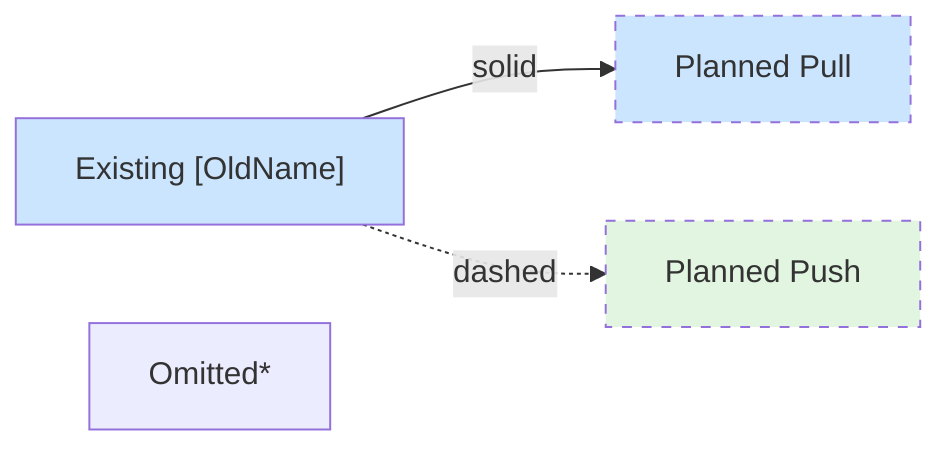

# transcription-rs API Design

## Overview

**transcription-rs** unifies transcription APIs behind a common interface.

Realtime streaming transcription APIs come in two styles—pull (you call, get result) and push (results arrive via callbacks). App developers want both styles too:
- Most prefer push for simplicity (just receive callbacks)
- Some need pull for control (custom buffering, timing, multi-stream)

transcription-rs abstracts away the impedance mismatch: backends implement whichever style matches their API, apps consume whichever style they prefer.

## Sub-Specs

Each spec follows the format: one-sentence insight → simple code example → details. Letters correspond to diagram labels below.

| | Spec | Insight | Audience |
|-|------|---------|----------|
| **(A)** | Transcript Type | One unified result shape for partial, final, and batch | Everyone |
| **(B)** | Streaming Engine | Pull-based core interface — the common target for all backends | Backend implementors, power users |
| **(C)** | High-Level Adapter | Push audio, receive callbacks — library handles threading | App developers |
| **(D)** | Push Adapter | 4 methods instead of 7 for WebSocket backends | Contributors adding cloud APIs |

**Why expose the low-level API (B)?** It's the common target for backend implementors, so all backends benefit from the high-level adapter (C). Minimal extra work to expose, and some users need the control.

**Why the high-level adapter (C)?** Without it, every app duplicates threading logic — easy to mess up. The library owns the decode thread; apps just push audio and receive callbacks.

**Why the push adapter (D)?** Push-based backends (Deepgram, OpenAI, ElevenLabs) don't fit the pull interface. `PushSource` is simpler to implement (4 methods vs 7), and `PushAdapter` converts it to the common interface.

See also: [Appendix](transcription-rs-appendix.md) (API survey, migration guide, implementation details)

## Architecture Diagrams

### Legend

### Batch Transcription (exists today)

### Streaming Transcription (planned)

### Combined View

