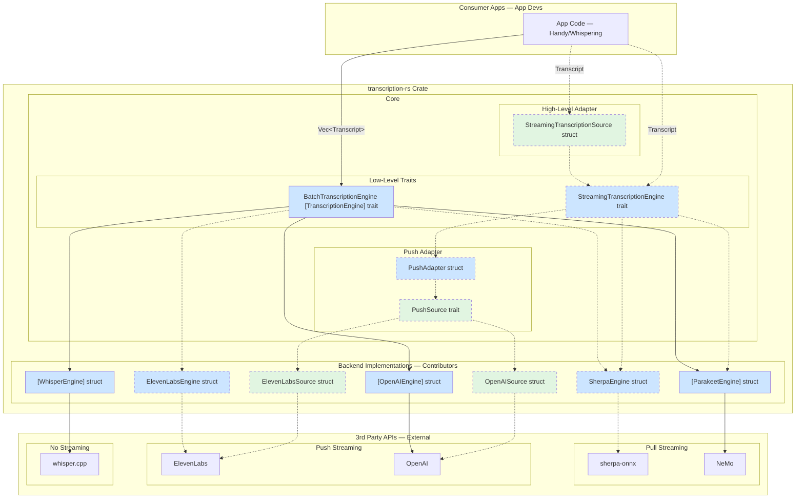

# transcription-rs API Design

## Overview

**transcription-rs** unifies transcription APIs behind a common interface.

Realtime streaming transcription APIs come in two styles—pull (you call, get result) and push (results arrive via callbacks). App developers want both styles too:
- Most prefer push for simplicity (just receive callbacks)
- Some need pull for control (custom buffering, timing, multi-stream)

transcription-rs abstracts away the impedance mismatch: backends implement whichever style matches their API, apps consume whichever style they prefer.



**Legend:**
- **Solid line/border** = exists today | **Dashed** = planned
- **Blue fill** = pull (`*Engine` — you call it) | **Green fill** = push (`*Source` — callbacks)
- **[Brackets]** in name = existing implementation

**This spec defines:**
- `StreamingTranscriptionEngine` trait — pull-based core interface
- `StreamingTranscriptionSource` — high-level callback API for app devs
- `PushSource` trait + `PushAdapter` — adapter for push-based backends (ElevenLabs, OpenAI), solves impedance mismatch with the pull-based core
- `Transcript` return type — common for streaming and batch, richer than current
- Migration path from legacy `transcribe-rs`

<details>
<summary>Naming changes — new crate enables consistent naming without breaking existing code</summary>

**Naming convention:**

| Pattern | Role | Style | You... | Examples |
|---------|------|-------|--------|----------|
| `*Engine` | both | pull | call it | `StreamingTranscriptionEngine`, `SherpaEngine` |
| `*Source` (backend) | contributor | push | implement for push APIs | `ElevenLabsSource`, `OpenAISource` |
| `StreamingTranscriptionSource` | app dev | push | receive callbacks | high-level API |

`PushAdapter` bridges the two: wraps a backend `*Source` to implement `*Engine`.

**Why no high-level batch API?** Batch transcription is synchronous and simple—users call `BatchTranscriptionEngine` directly. Streaming needs `StreamingTranscriptionSource` to handle threading, callbacks, and push→pull conversion.

**Why a new crate:**

| Crate                  | Status     | Purpose                                                    |
| ---------------------- | ---------- | ---------------------------------------------------------- |
| **`transcription-rs`** | New        | Rich API with streaming support, `Transcript` type         |
| **`transcribe-rs`**    | Deprecated | Thin wrapper, transforms to old `TranscriptionResult` type |

**Changes from legacy:**

| Legacy (transcribe-rs) | New (transcription-rs) | Notes |
|------------------------|------------------------|-------|
| `TranscriptionEngine` trait | `BatchTranscriptionEngine` trait | Added "Batch" prefix for clarity |
| `TranscriptionResult` | `Transcript` | Richer fields |
| — | `StreamingTranscriptionSource` struct | New: high-level streaming API (callback-based) |
| — | `StreamingTranscriptionEngine` trait | New: low-level streaming interface (pull-based) |
| — | `PushSource` trait | New: for push-based backends |
| — | `PushAdapter` struct | New: wraps `PushSource` as `StreamingTranscriptionEngine` |

**Migration:**

```toml
# Old
[dependencies]
transcribe-rs = "0.2"  # now wraps transcription-rs

# New (recommended)
[dependencies]
transcription-rs = "0.1"
```

For code that used `TranscriptionResult.text` (joined text), use the included helper:

```rust
// Before (legacy)
let result = engine.transcribe(&audio)?;
println!("{}", result.text);  // TranscriptionResult.text was pre-joined

// After (new)
use transcription_rs::joined_text;
let transcripts = engine.transcribe(&audio)?;
println!("{}", joined_text(&transcripts));  // explicitly join segments
```

</details>

## Architecture

Pull is the common internal interface. transcription-rs adapts both directions:

| | Pull | Push |
|---|---|---|
| **3rd-party examples** | sherpa-onnx, NeMo | Deepgram, ElevenLabs |
| **Contributor implements** | `StreamingTranscriptionEngine` | `PushSource` (simpler) |
| **App dev uses** | `StreamingTranscriptionEngine` (control) | `StreamingTranscriptionSource` (simple) |

**Why this saves code:** Any backend works with either app API style. Without adapters, each backend would implement both styles. With adapters, each backend implements one trait, transcription-rs handles the rest.

## Data Types

Both API layers return the same `Transcript` type with optional word-level detail. Supporting types include:
- `Word` for per-word timing
- `Speaker` for diarization
- `Alternative` for n-best hypotheses.

<details>
<summary>Annotated struct definitions — <code>Transcript</code>, <code>Word</code>, <code>Speaker</code>, <code>Alternative</code></summary>

```rust
pub struct Transcript {
    pub text: String,

    // Result-level finality
    pub is_final: bool,               // this result won't be revised
    pub is_endpoint: bool,            // natural speech boundary detected (silence/pause)
    pub segment_id: u32,              // same ID for all revisions of one utterance

    // Timing (seconds from stream/file start)
    pub start: Option<f32>,
    pub end: Option<f32>,

    // Confidence
    pub confidence: Option<f32>,      // 0.0-1.0, overall confidence score

    // Language
    pub language: Option<String>,     // detected/specified language code (e.g., "en", "en-US")
    pub language_confidence: Option<f32>, // 0.0-1.0, confidence in language detection

    // Speaker diarization
    pub speaker: Option<Speaker>,     // speaker identifier for this segment

    // Multi-channel audio
    pub channel: Option<u32>,         // audio channel index (0-based)

    // Word-level detail
    pub words: Option<Vec<Word>>,

    // N-best alternatives
    pub alternatives: Option<Vec<Alternative>>, // alternative transcriptions for same audio

    // Raw backend response for debug/niche fields (requires `include_raw: true`)
    pub raw: Option<serde_json::Value>,
}

/// Speaker identifier - backends use different schemes
#[derive(Debug, Clone, PartialEq)]
pub enum Speaker {
    Id(u32),           // numeric ID (0, 1, 2...) - Deepgram, Azure, Rev.ai
    Label(String),     // string label ("A", "B", "speaker_1") - AssemblyAI, Google
}

/// Alternative transcription hypothesis (n-best)
pub struct Alternative {
    pub text: String,
    pub confidence: Option<f32>,
    pub words: Option<Vec<Word>>,
}

pub struct Word {
    pub text: String,                 // the word text
    pub punctuated: Option<String>,   // with punctuation/caps (e.g., "yeah" → "Yeah.")
    pub start: f32,                   // start time (seconds)
    pub end: f32,                     // end time (seconds)
    pub confidence: Option<f32>,      // 0.0-1.0
    pub speaker: Option<Speaker>,     // speaker for this word (may differ from segment)
}

impl Transcript {
    /// Check if this result supersedes a previous partial (same segment, more final)
    pub fn supersedes(&self, other: &Transcript) -> bool {
        self.segment_id == other.segment_id && (self.is_final || !other.is_final)
    }
}
```

</details>

<details>
<summary>Design notes</summary>

- `is_final` - "this result text won't be revised" (matches Deepgram/AWS `IsPartial: false`). Use for UI display decisions.
- `is_endpoint` - "speaker paused/stopped, segment complete" (matches Deepgram `speech_final`, sherpa `is_endpoint()`). Use to trigger `reset()`.
- After `input_finished()`, drain until `is_ready()` returns false. `get_result()` returns `None` when no result is available.
- `segment_id` groups all revisions of one utterance (partials share the same ID as their final). Use `supersedes()` to check if a new result replaces an old partial.
- `words` replaces both `tokens` and `timestamps` arrays - richer, aligned with cloud APIs. If a backend lacks word-level timing, `words` is `None` (not a vec of words with missing timestamps).
- `confidence` at word level: serves as both model certainty and stability indicator. Backends with boolean `Stable` map to `1.0`/`0.5`. For streaming, interim results may populate `confidence` with stability scores (how likely this partial will change).
- `speaker` - backends vary: Deepgram/Azure use numeric IDs, AssemblyAI/Google use string labels. The `Speaker` enum preserves this distinction.
- `channel` - for stereo/multi-channel audio (e.g., call center: agent=0, customer=1).
- `alternatives` - n-best hypotheses for the same audio segment. Primary hypothesis is in `text`/`words`; alternatives provide ranked fallbacks with their own confidence and optional word detail.
- `raw` - full backend response for debugging or accessing niche fields. **Disabled by default**; enable via `Config { include_raw: true, .. }`.
- `punctuated` - Deepgram's `punctuated_word` pattern. Useful when you need both raw ("yeah") and display ("Yeah.") forms.
- Batch API returns this type with `is_final: true`, `is_endpoint: true` always.

</details>

## API Layers

Choose one:

- **[High Level](#high-level-callback-based-streamingtranscriptionsource):** Push audio, receive callbacks. Library manages threading.
- **[Low Level](#low-level-streamingtranscriptionengine-trait):** Pull-based decode loop. Consumer has full control.

| Use Case                      | Layer | Why                             |
| ----------------------------- | ----- | ------------------------------- |
| Tauri app, simple integration | High  | No threading concerns           |
| Custom buffering/timing       | Low   | Full control over decode loop   |
| WebSocket server              | Low   | Need to manage multiple streams |
| Testing/debugging             | Low   | Inspect each decode step        |

### High Level: Callback-Based StreamingTranscriptionSource

Library owns threading. Consumer just pushes audio and receives callbacks.

```rust
impl StreamingTranscriptionSource {
    pub fn new(engine: impl StreamingTranscriptionEngine + Send + 'static) -> Self;

    pub fn start_listening<F>(&self, callback: F) -> Result<(), Error>
    where
        F: Fn(Result<Transcript, Error>) -> Result<(), Error> + Send + 'static;

    pub fn push_audio(&self, samples: &[f32]);

    pub fn stop_listening(&self) -> Result<(), Error>;
}
```

#### Usage (Tauri)

```rust
let engine = SherpaEngine::new(config)?;
let source = transcription_rs::StreamingTranscriptionSource::new(engine);

source.start_listening(|result| {
    match result {
        Ok(r) if r.is_final => app.emit("final", &r)?,
        Ok(r) => app.emit("partial", &r.text)?,
        Err(e) => app.emit("error", e.to_string())?,
    }
    Ok(())  // return Err to stop listening
})?;

// Called from Tauri's cpal audio callback
source.push_audio(&samples);

// When done
source.stop_listening()?;
```

<details>
<summary>Internal implementation</summary>

High level is built on low level:

```rust
impl StreamingTranscriptionSource {
    pub fn start_listening<F>(&self, callback: F) -> Result<(), Error>
    where
        F: Fn(Result<Transcript, Error>) -> Result<(), Error> + Send + 'static
    {
        let (audio_tx, audio_rx) = channel();
        let (result_tx, result_rx) = channel();

        // Decode thread - uses low-level API
        let mut engine = self.create_engine()?;
        thread::spawn(move || {
            loop {
                let samples: Vec<f32> = match audio_rx.recv() {
                    Ok(s) => s,
                    Err(_) => {
                        // Channel closed - flush remaining audio
                        engine.input_finished();
                        for result in drain_results(&mut engine) {
                            let _ = result_tx.send(Ok(result));
                        }
                        break;
                    }
                };

                engine.accept_waveform(&samples);

                // Drain all results, send each to callback thread
                while engine.is_ready() {
                    if let Err(e) = engine.decode() {
                        let _ = result_tx.send(Err(e));
                        break;
                    }
                    if let Some(result) = engine.get_result() {
                        if result_tx.send(Ok(result)).is_err() {
                            break;
                        }
                    }
                }
                // Reset after segment boundary (not inside drain loop)
                if engine.is_endpoint() {
                    engine.reset();
                }
            }
        });

        // Callback thread
        thread::spawn(move || {
            for result in result_rx {
                if callback(result).is_err() {
                    break;
                }
            }
        });

        *self.audio_tx.lock().unwrap() = Some(audio_tx);  // audio_tx: Mutex<Option<Sender>>
        Ok(())
    }
}
```

**Thread Model:**

```
CONSUMER THREAD                 transcription-rs INTERNAL THREADS

┌──────────────────┐           ┌──────────────────┐    ┌──────────────────┐
│ cpal callback    │           │ Decode Thread    │    │ Callback Thread  │
│                  │           │                  │    │                  │
│ engine           │   chan    │ accept_waveform  │chan│ loop {           │
│  .push_audio() ─────────────▶│ drain_results() ─────▶│   callback(r)   │
│                  │           │ for each result  │    │ }                │
└──────────────────┘           └──────────────────┘    └──────────────────┘
                                                              │
                                                              ▼
                                                        app.emit()
```

</details>

### Low Level: StreamingTranscriptionEngine Trait

Mirrors sherpa-onnx's actual API. Full control, consumer manages the decode loop.

```rust
pub trait StreamingTranscriptionEngine {
    fn accept_waveform(&mut self, samples: &[f32]);
    fn input_finished(&mut self);  // signal end of stream, flush remaining frames
    
    /// Check if engine has enough buffered audio for one decode step.
    /// Default returns true (always attempt decode).
    fn is_ready(&self) -> bool { true }
    
    fn decode(&mut self) -> Result<(), Error>;
    fn get_result(&self) -> Option<Transcript>;
    fn is_endpoint(&self) -> bool;
    fn reset(&mut self);
}
```

<details>
<summary>Why <code>is_ready()</code> has a default implementation</summary>

Different models have different chunk size requirements baked into their architecture:

| Model | ChunkSize | Approx. Audio Duration |
|-------|-----------|------------------------|
| Zipformer2 | 32-64 frames | 320-640ms |
| Paraformer | 61 frames | 610ms |
| Whisper streaming | varies | model-dependent |
| Deepgram (push) | N/A | server decides |

The `is_ready()` check is inherently model-specific. Backends like `SherpaEngine` can implement smart readiness checks that delegate to the underlying model, while simpler backends or push-based adapters can use the default `true` (always attempt decode, let `decode()` return early if needed).

</details>

#### Usage

```rust
let mut engine = SherpaEngine::new(config)?;

loop {
    let samples = mic.read_chunk();
    engine.accept_waveform(&samples);

    for result in drain_results(&mut engine) {
        if result.is_final {
            println!("Final: {}", result.text);
        } else {
            print!("\rPartial: {}", result.text);
        }
    }
    // Reset after segment boundary (not inside drain loop)
    if engine.is_endpoint() {
        engine.reset();
    }

    if user_stopped() {
        break;
    }
}

// Signal end of stream, flush remaining audio
engine.input_finished();
for result in drain_results(&mut engine) {
    println!("{}", result.text);
}
```

<details>
<summary>Example helper — <code>drain_results()</code></summary>

Example pattern (not included in crate—customize error handling as needed):

```rust
/// Drain all pending results from engine (runs decode loop internally).
/// Stops on error; use decode() directly for error handling.
fn drain_results(engine: &mut impl StreamingTranscriptionEngine) -> Vec<Transcript> {
    let mut results = vec![];
    while engine.is_ready() {
        if engine.decode().is_err() {
            break;
        }
        if let Some(result) = engine.get_result() {
            results.push(result);
        }
    }
    results
}
```

</details>

### Push-Based Backends: PushSource + PushAdapter

For push-based backends (like ElevenLabs WebSocket, OpenAI), contributors implement the simpler `PushSource` trait instead of `StreamingTranscriptionEngine`:

```rust
pub trait PushSource {
    fn start(&mut self, emit: impl Fn(Result<Transcript, Error>) + Send) -> Result<(), Error>;
    fn send_audio(&mut self, samples: &[f32]) -> Result<(), Error>;
    fn finish(&mut self) -> Result<(), Error>;
    fn stop(&mut self);
}
```

The library provides `PushAdapter<P: PushSource>` which wraps any `PushSource` and implements `StreamingTranscriptionEngine`:

```rust
// Contributor implements PushSource
struct ElevenLabsSource { /* WebSocket connection, etc. */ }
impl PushSource for ElevenLabsSource { /* ... */ }

// Library wraps it as StreamingTranscriptionEngine
let source = ElevenLabsSource::new(api_key, options)?;
let engine = PushAdapter::new(source);
let source = StreamingTranscriptionSource::new(engine);
```

This allows push-based backends to work with `StreamingTranscriptionSource` without manually implementing the pull-based `StreamingTranscriptionEngine` interface.

<details>
<summary><code>StreamingTranscriptionEngine</code> vs <code>PushSource</code> — when to implement which</summary>

`StreamingTranscriptionEngine` (7 methods) mirrors pull-based APIs like sherpa-onnx. `PushSource` (4 methods) is simpler for push-based backends—just emit results when they arrive. `PushAdapter` handles the push→pull conversion (buffering, threading, backpressure).

</details>

### FAQ

<details>
<summary>How does a consumer switch between online, sentence, or simulated streaming?</summary>

By choosing a backend. The streaming strategy is an implementation detail—all backends expose the same `StreamingTranscriptionEngine` trait, so usage code is identical:

```rust
let engine = SherpaEngine::new(config)?;  // backend choice determines strategy
let source = StreamingTranscriptionSource::new(engine);
source.start_listening(callback)?;
source.push_audio(&samples);
```

| Strategy                                          | Implementation                                                                  |
| ------------------------------------------------- | ------------------------------------------------------------------------------- |
| **Online streaming** (Sherpa/NeMo)                | Implements `StreamingTranscriptionEngine` directly                              |
| **Sentence-based** (VAD)                          | Wrapper buffers until VAD signals end of speech, then calls batch transcription |
| **Simulated streaming** (streaming-whisper style) | Wrapper with sliding window, returns partials via `StreamingTranscriptionEngine`|

**Design note:** Whether VAD runs inside or outside the engine is an implementation choice per-strategy:

| Strategy | VAD Role |
|----------|----------|
| **Online** | Typically none or energy-gating only — continuous partials needed |
| **Sentence-based** | Core component — VAD defines segment boundaries |
| **Simulated** | Optional — may use VAD to trigger final commit |

The key insight: `accept_waveform(&[f32])` as the universal input allows all strategies to be implemented as layers. Native streaming models implement `StreamingTranscriptionEngine` directly; wrappers add VAD/windowing logic on top of batch models while exposing the same trait. This keeps the abstraction boundary clean — consumers don't care which strategy a backend uses.

</details>

<details>
<summary>What's the difference between <code>is_final</code> and <code>is_endpoint</code>?</summary>

- `is_final` — "this text won't be revised". Use for UI display decisions (show as committed text).
- `is_endpoint` — "speaker paused/stopped, segment complete". Use to trigger `reset()`.

A result can be `is_final` without being `is_endpoint` (text is stable but speaker hasn't paused yet).

</details>

<details>
<summary>Why route ElevenLabs/OpenAI through <code>PushAdapter</code>? They're already push-based.</summary>

`PushAdapter` converts push-based backends into the pull-based `StreamingTranscriptionEngine` interface. This lets users:

- Call `decode()` / `get_result()` synchronously instead of only using callbacks
- Use the same consumption pattern for local and cloud backends
- Swap backends without changing how results are consumed

Without this conversion, cloud backends would only be usable via callbacks, breaking API uniformity.

</details>

<details>
<summary>How do errors propagate?</summary>

| Error Source      | High Level                         | Low Level                            |
| ----------------- | ---------------------------------- | ------------------------------------ |
| Decode fails      | Sent as `Err(e)` to callback       | Returns error from `decode()`        |
| Consumer error    | Callback returns `Err`, loop stops | Consumer handles directly            |
| End of stream     | `stop_listening()` signals end     | Consumer calls `input_finished()`    |
| Endpoint detected | Auto-reset after drain             | Consumer calls `reset()` after drain |

</details>

<details>
<summary>How does VAD (Voice Activity Detection) fit in?</summary>

VAD is **orthogonal to transcription**—it's an audio preprocessing concern. This spec keeps VAD out of the core API because use cases vary (some backends have it built-in, others don't need it).

| Concept | What it detects | Where it lives |
|---------|-----------------|----------------|
| **VAD** | "Is someone speaking right now?" | Pre-processor (before ASR) |
| **`is_endpoint()`** | "Did the speaker pause/finish?" | Decoder (informed by language model) |

VAD filters silence *before* audio reaches the engine. `is_endpoint()` detects pauses *during* decoding, often using linguistic cues that VAD can't see.

</details>

### Reference

<details>
<summary>API Survey</summary>

| API | Finality | Endpoint | Confidence | Speaker | Channel | Alternatives |
|-----|----------|----------|------------|---------|---------|--------------|
| sherpa-onnx | N/A | `is_endpoint()` | N/A | N/A | N/A | N/A |
| Deepgram | `is_final` | `speech_final` | 0.0-1.0 | `speaker: int` | `channel` | `alternatives[]` |
| AssemblyAI | `message_type` | `end_of_turn` | 0.0-1.0 | `speaker: "A","B"` | `channel` | N/A |
| AWS Transcribe | `IsPartial` | natural segments | 0.0-1.0, `Stable` | `Speaker: string` | `ChannelId` | `Alternatives[]` |
| Google Cloud | `isFinal` | `speechEventType` | 0.0-1.0, `stability` | `speakerLabel` | `channelTag` | `alternatives[]` |
| Azure | `RecognitionStatus` | implicit | 0.0-1.0 | `speaker: int` | `channel` | `NBest[]` |
| OpenAI Realtime | event types | VAD events | via `logprobs` | `speaker` | N/A | N/A |
| ElevenLabs | `partial`/`committed` | `commit_strategy` | `logprob` | N/A | N/A | N/A |
| Rev.ai | `type: final/partial` | implicit | 0.0-1.0 | `speaker: int` | N/A | N/A |
| Vosk | `partial` vs `result` | implicit | `conf` | `spk` (embedding) | N/A | `alternatives[]` |

**Field mappings to `Transcript`:**

| API Field | Transcript Field | Notes |
|-----------|------------------|-------|
| `is_final`, `isFinal`, `!IsPartial` | `is_final` | |
| `speech_final`, `end_of_turn`, `speechEventType` | `is_endpoint` | |
| `confidence`, `conf` | `confidence` | 0.0-1.0 |
| `stability` (Google interim) | `confidence` | Maps stability → confidence for partials |
| `Stable: bool` (AWS) | `confidence` | `true` → 1.0, `false` → 0.5 |
| `speaker`, `speakerLabel`, `Speaker` | `speaker` | `Speaker::Id` or `Speaker::Label` |
| `channel`, `channelTag`, `ChannelId` | `channel` | 0-based index |
| `alternatives`, `NBest` | `alternatives` | |
| `punctuated_word` (Deepgram) | `Word.punctuated` | |
| `language`, `languageCode` | `language` | |
| `LanguageIdentification[].Score` | `language_confidence` | |

</details>

<details>
<summary>Batch API Comparison</summary>

**`transcription-rs`** (new crate):

```rust
// Borrows samples, returns flat list of Transcript
fn transcribe_samples(&mut self, samples: &[f32], ...) -> Result<Vec<Transcript>, Error>;
fn transcribe_file(&mut self, path: &Path, ...) -> Result<Vec<Transcript>, Error>;
```

**`transcribe-rs`** (deprecated wrapper):

```rust
// Old signature preserved - wraps transcription-rs internally
fn transcribe_samples(&mut self, samples: Vec<f32>, ...) -> Result<TranscriptionResult, Error>;
fn transcribe_file(&mut self, path: &Path, ...) -> Result<TranscriptionResult, Error>;
```

| Aspect        | `transcription-rs` | `transcribe-rs` (wrapper)                    |
| ------------- | ------------------ | -------------------------------------------- |
| Samples param | `&[f32]` (borrow)  | `Vec<f32>` (owned)                           |
| Return type   | `Vec<Transcript>`  | `TranscriptionResult` with nested `segments` |
| Streaming     | Full support       | Not exposed                                  |

</details>


